# QuantScout量化选股系统

> 基于东财掘金量化平台的智能选股与参数优化系统

[](LICENSE)
[](https://www.microsoft.com/windows)
[](https://www.python.org/downloads/)

## 📖 项目简介

> ⚠️ **重要声明**：这是一个**纯量化学习和 Vibe Coding 学习项目**，所有指标、因子组合仅为**散户自由搭配水平**，不具备专业投产策略的水准。核心目的是学习量化策略开发流程和 AI 辅助编程（Vibe Coding），而非提供可直接用于实盘交易的策略。

### 项目定位

QuantScout 是一个基于东财掘金量化平台的智能选股与参数优化系统，同时也是一个**完整的量化学习实践项目**。通过本项目，你可以系统学习量化策略开发的完整流程：

| 学习环节 | 对应模块 | 说明 |
|---------|---------|------|
| **数据获取** | `data/stock_data_provider.py` | 学习如何通过掘金 API 获取股票行情数据 |
| **数据处理** | `data/batch_processor.py` | 学习并行批量处理大规模股票数据的方法 |
| **数据存储** | `cache/data_cache.py` | 学习 SQLite 缓存机制和数据持久化 |
| **量化指标配置** | `indicators/` | 学习 KDJ、知行趋势、深V信号等技术指标的计算逻辑 |
| **筛选评分环节** | `scoring/` + `strategies/` | 学习多维度综合评分和权重配置系统 |
| **回测验证** | `strategy_engine/` | 学习策略回测引擎的设计与实现 |
| **参数优化** | `ulti-para-seeker/` | 学习暴力搜索、遗传算法、粒子群算法的优化方法 |

此外，本项目本身也是 **Vibe Coding（AI 辅助编程）** 的实践成果——从需求分析、架构设计到代码实现，全程借助 AI 辅助完成，是学习 AI 编程协作的优秀案例。

**核心功能：**

- **智能选股**：基于KDJ、知行趋势、深V信号等多维度指标的综合策略
- **参数优化**：支持暴力搜索、遗传算法、粒子群算法等多种优化算法
- **回测分析**：完整的策略回测功能，支持多种止盈止损策略
- **可视化界面**：基于Streamlit的现代化Web界面，操作简单直观
- **权重配置**：灵活的权重配置系统，支持自定义评分权重
- **安全认证**：Token加密存储，保障API安全

**技术亮点：**

- **模块化架构**：UI/业务/展示/工具模块分离，职责清晰
- **多算法优化引擎**：内置三种优化算法，满足不同场景需求
- **策略-回测-优化闭环**：完整的量化策略开发流程
- **实时并行计算**：支持全量A股分批并行处理，提升选股效率
- **灵活的权重系统**：支持7个核心指标权重调整和子权重配置

## 📸 界面截图

### 系统首页

| 首页概览 | 使用说明 |
|:---:|:---:|
| 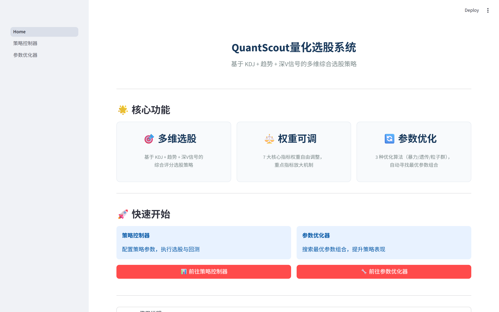 | 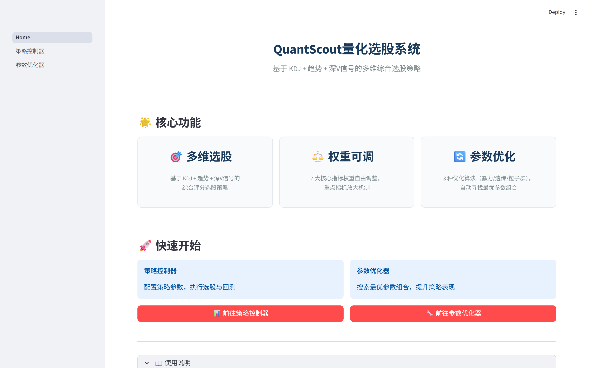 |

### 策略控制器

| Token配置 | 权重配置 | 高级子权重 |
|:---:|:---:|:---:|
| 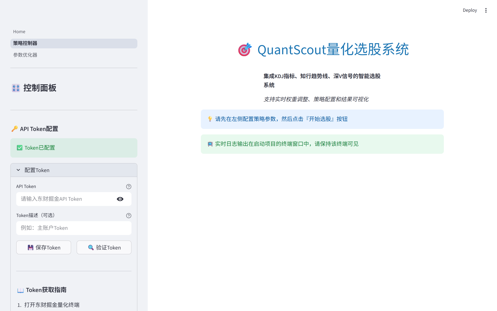 | 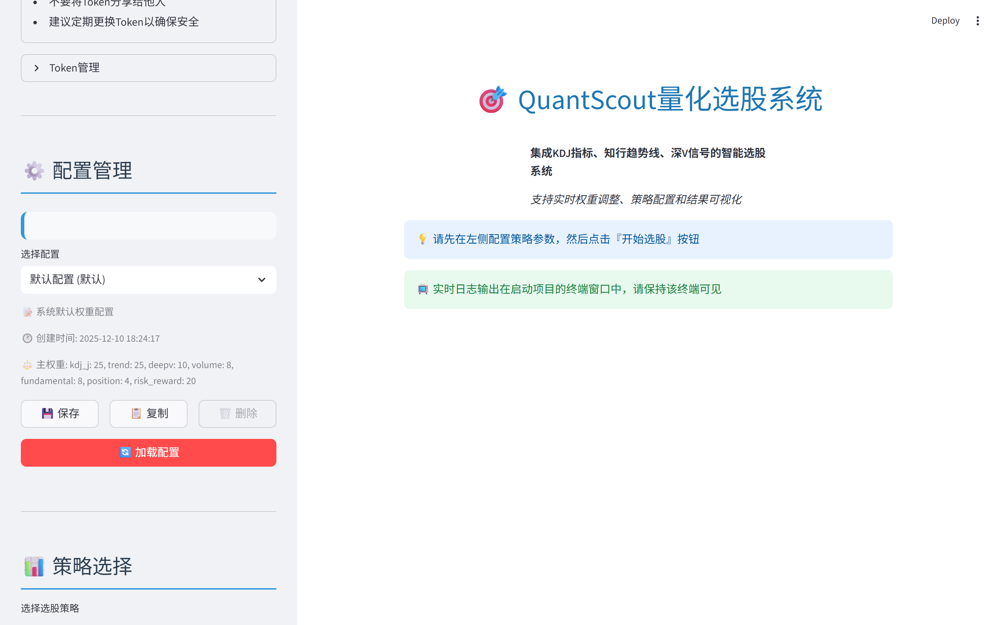 | 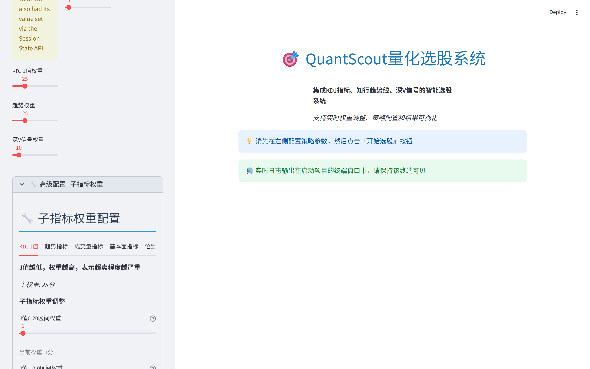 |

| 筛选参数 | 选股执行 | 选股结果 |
|:---:|:---:|:---:|
|  | 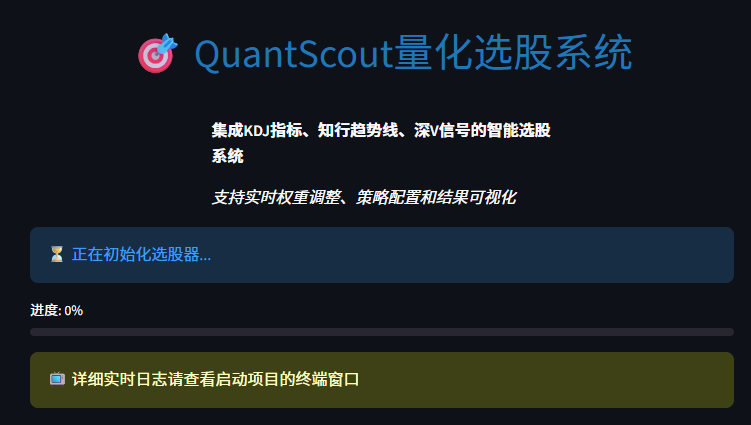 | 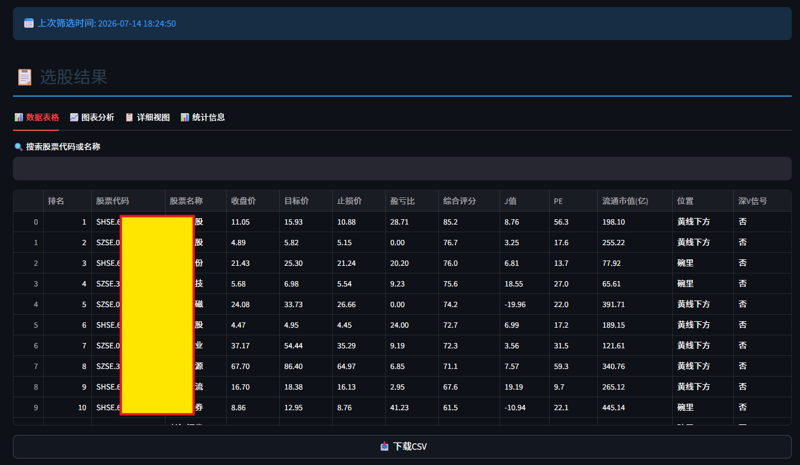 |

### 参数优化器

| 优化器概览 | 优化配置 | 优化结果 |
|:---:|:---:|:---:|
| 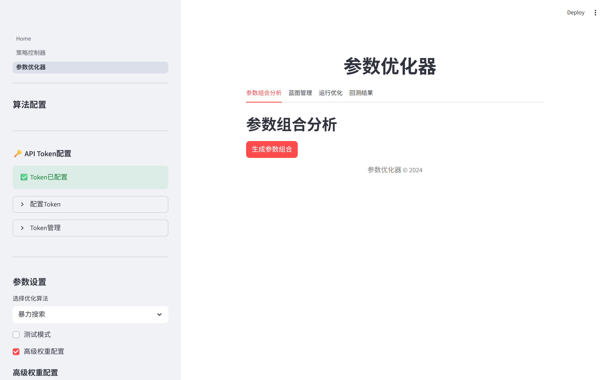 | 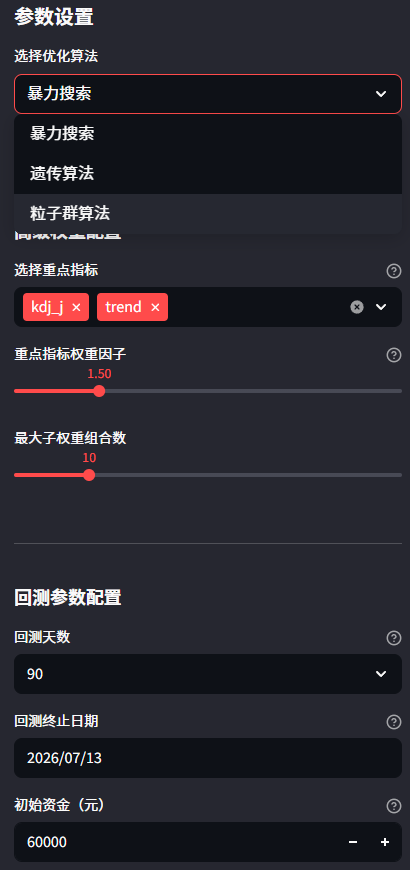 | 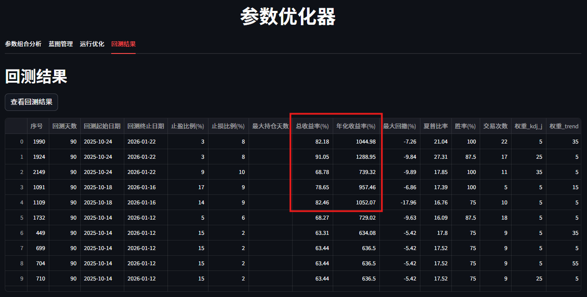 |

### 回测分析

| 回测配置 | 回测图表1 | 回测图表2 |
|:---:|:---:|:---:|
| 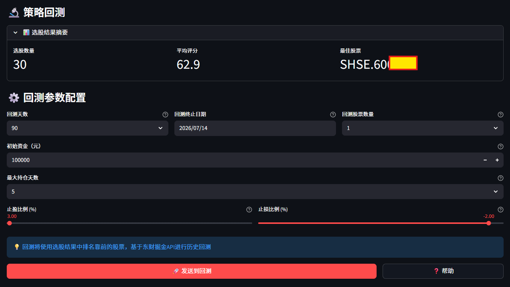 | 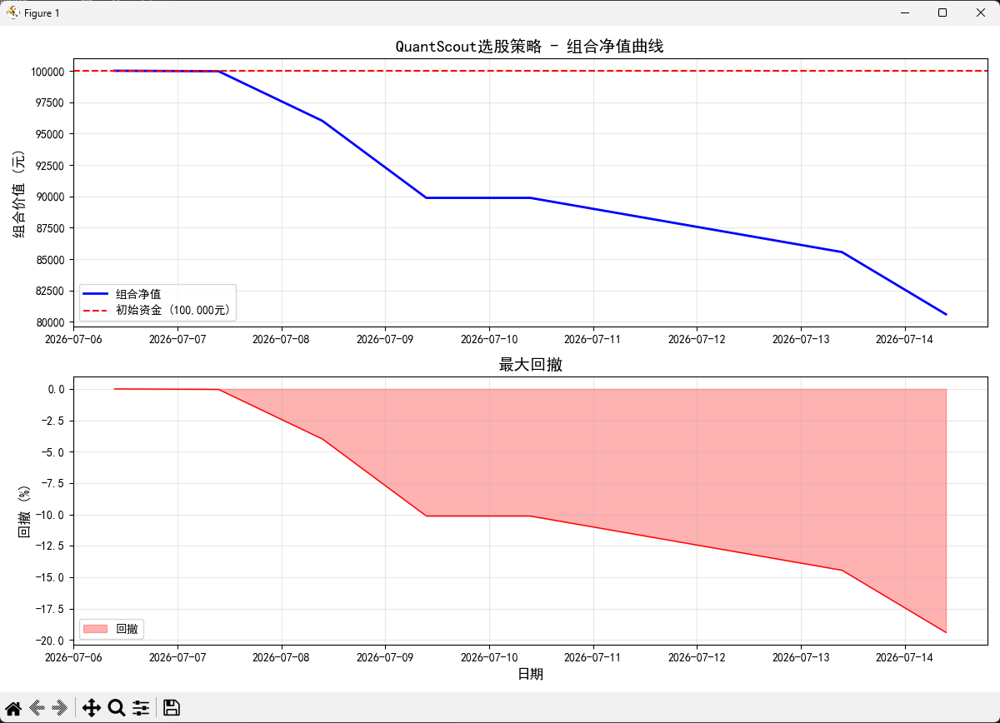 | 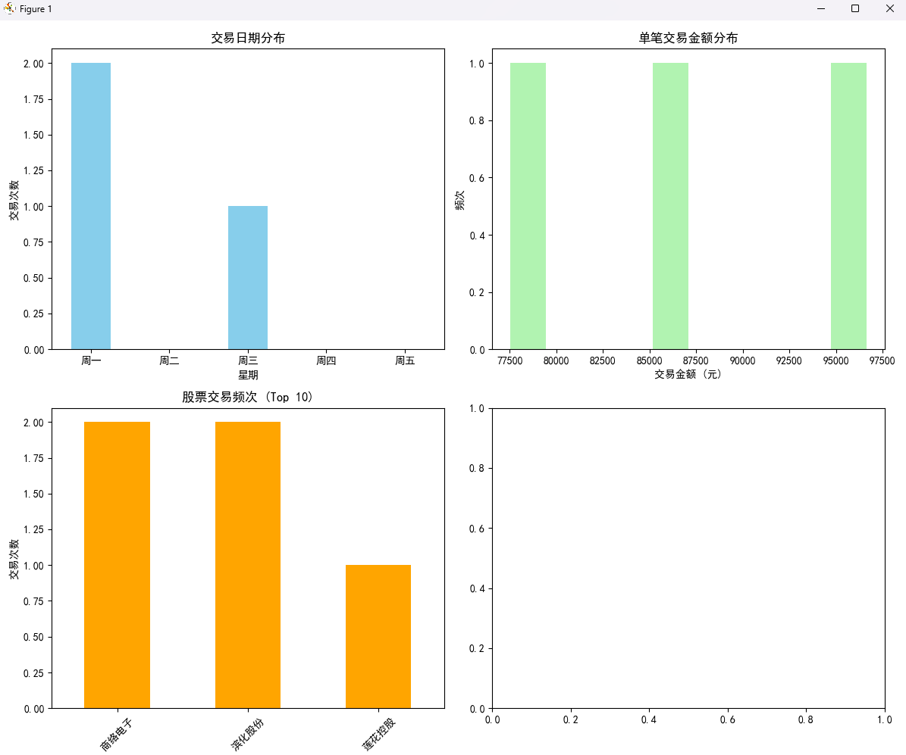 |

| 组合收益率分布 | 东财终端回测 |
|:---:|:---:|
| 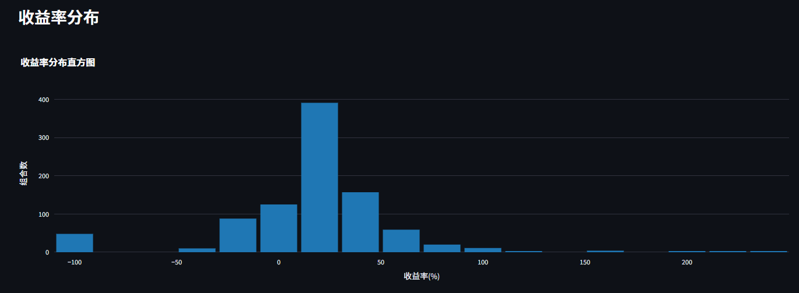 | 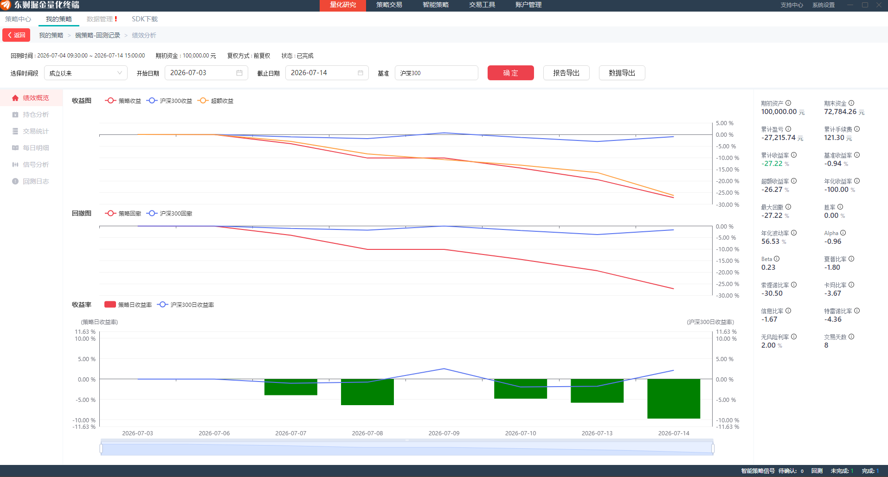 |

## ⚠️ 系统要求

### 必须满足的条件

- **操作系统**：Windows 10/11（东财掘金终端仅支持Windows）
- **Python版本**：Python 3.8 或更高版本
- **必备软件**：东财掘金量化终端（需提前安装并启动）
- **API SDK**：gm SDK（通过pip安装）

### 推荐配置

- **内存**：8GB 或更高
- **处理器**：Intel i5 或同等性能处理器
- **网络**：稳定的互联网连接（用于获取股票数据）

---

## 📦 东财掘金量化终端下载与安装指南

本系统依赖东财掘金量化平台获取股票数据，以下是官方下载地址和使用方式汇总。

### 一、官方综合主页

| 页面 | 地址 | 说明 |
|------|------|------|
| **机构量化业务总站** | [https://emt.18.cn/](https://emt.18.cn/) | 主入口，可办理仿真/实盘权限、下载终端、查看文档 |
| **终端专用下载页面** | [https://emt.18.cn/down](https://emt.18.cn/down) | 独立下载页，区分掘金独立端、移动端、配套工具包 |
| **量化帮助文档主页** | [https://emquant.18.cn/help/?doc=guide](https://emquant.18.cn/help/?doc=guide) | SDK、策略开发、回测、实盘完整教程官网文档 |

### 二、独立终端直链下载

**Windows x64 安装包（最新稳定版）**：
```
https://zqcdn.eastmoneysec.com.cn/emquant/eastmoney-public/Emgm3-x64-3.22.0.18.exe
```

### 三、两种使用入口方式

#### 方式1：独立掘金终端（推荐专业用户）

支持**仿真+实盘**，功能完整：

1. 打开 [https://emt.18.cn/down](https://emt.18.cn/down)
2. 点击「东财掘金独立端」下载安装包
3. 需先在 [emt.18.cn](https://emt.18.cn/) 申请**仿真账号**或**实盘量化权限**才可登录实盘交易（实盘要求专业投资者认证）
4. 启动终端后保持运行状态，本系统才能获取数据

#### 方式2：东方财富经典PC版内嵌量化（仅仿真）

无需单独下载，适合快速体验：

1. 东方财富经典版下载：[https://swdlcdn.eastmoney.com/swc8_free_new/dfcft8.exe](https://swdlcdn.eastmoney.com/swc8_free_new/dfcft8.exe)
2. 打开软件左侧栏「全景图」→「量化」，自动弹出轻量化掘金仿真环境
3. **限制**：仅能回测、仿真，无实盘权限

### 四、区分提醒（避免混淆）

| 平台 | 官网 | 特点 |
|------|------|------|
| **东财掘金（东方财富证券版）** | [https://emt.18.cn/](https://emt.18.cn/) | 东方财富证券合作版，可股票实盘，需证券账户+专业投资者认证 |
| **通用掘金量化** | [https://www.myquant.cn/](https://www.myquant.cn/) | 独立第三方官网，多券商通用，和东财版账号**不互通** |

> ⚠️ **注意**：本项目使用的是**东财掘金（emt.18.cn）**，与通用掘金量化（myquant.cn）账号不互通，请确保从正确的官网下载和注册。

### 五、使用前置条件

- **仅Windows系统支持**：独立终端暂无Mac原生客户端
- **实盘交易要求**：必须完成专业投资者认证，并在 [emt.18.cn](https://emt.18.cn/) 提交掘金实盘开通申请
- **仿真测试**：可直接在东方财富经典版内使用，无需单独申请权限
- **终端运行状态**：使用本系统前，必须保持掘金量化终端登录运行状态

---

## 🚀 快速开始

### 1. 安装东财掘金量化终端

详细下载地址和安装指南请参考上方「📦 东财掘金量化终端下载与安装指南」章节，核心步骤：

1. 从 [https://emt.18.cn/down](https://emt.18.cn/down) 下载独立终端安装包
2. 安装并登录量化终端（需先申请仿真账号）
3. 启动量化终端（使用本系统前必须保持运行状态）

> ⚠️ **重要**：本系统依赖掘金终端获取数据，终端必须始终运行！

### 2. 安装Python依赖

使用requirements.txt文件安装（推荐）：

```bash
pip install -r requirements.txt
```

或手动安装所需包：

```bash
pip install streamlit==1.36.0 plotly==5.23.0 pandas==2.2.0 numpy==1.26.0 gm==1.0.0 openpyxl==3.1.2 cryptography==42.0.0 requests==2.32.0
```

### 3. 获取API Token

1. 打开东财掘金量化终端
2. 进入「系统设置」→「密钥管理」
3. 点击「生成Token」按钮
4. 复制生成的Token（后续配置时需要使用）

### 4. 启动应用

#### 方式一：使用 Streamlit 多页面架构（推荐）

```bash
streamlit run Home.py
```

启动后会打开浏览器，通过左侧导航栏切换"策略控制器"和"参数优化器"页面。

#### 方式二：双击 .bat 启动脚本（小白用户首选）

在项目根目录下双击对应 `.bat` 文件：

| 脚本 | 功能 |
|------|------|
| `一键启动全部.bat` | 同时启动策略控制器和参数优化器（推荐） |
| `启动策略控制器.bat` | 仅启动策略选股系统 |
| `启动参数优化器.bat` | 仅启动参数优化系统 |

脚本会自动激活 conda dcquant 环境并设置 UTF-8 编码。

#### 方式三：使用启动器（兼容保留）

```bash
python launcher.py
```

启动器提供以下选项：

1. **启动策略控制器** - 独立启动策略选股系统（端口：8502）
2. **启动参数优化器** - 独立启动参数优化系统（端口：8501）
3. **同时启动两个应用** - 一键启动两个系统
4. **测试后端选股功能** - 快速测试系统是否正常工作
5. **显示帮助信息** - 查看使用说明
6. **退出** - 退出启动器

> 注：launcher.py 为旧版入口，仍可使用，但推荐使用 `streamlit run Home.py`。

#### 方式四：直接启动单个应用（兼容保留）

**启动策略控制器：**
```bash
streamlit run strategy_controller/main.py --server.port 8502
```

**启动参数优化器：**
```bash
streamlit run ulti-para-seeker/app.py --server.port 8501
```

> 注：以上为旧版独立启动方式，仍可使用。推荐使用 `streamlit run Home.py` 统一入口。

### 5. 配置API Token

首次使用时，需要在应用界面中配置API Token：

1. 打开应用界面（默认浏览器自动打开）
2. 在左侧边栏找到「API Token配置」区域
3. 点击「配置Token」展开配置面板
4. 粘贴之前获取的Token
5. 点击「保存Token」完成配置

### ⚠️ 掘金终端回测前置条件

使用东财掘金量化终端的回测功能时，必须满足以下条件：

1. **在掘金量化终端中创建策略项目**：先在终端内创建一个策略项目
2. **项目代码放入策略目录**：将本项目代码（通过 git clone 或复制）放入该策略项目目录下
3. **回测入口文件**：根目录的 `main.py` 是掘金终端回测的入口文件
4. **终端运行状态**：回测时需保持掘金量化终端登录运行状态

> 注意：`main.py` 是掘金终端回测专用入口。选股和参数优化功能通过 Streamlit 界面（`Home.py`）使用即可，无需依赖掘金终端的策略目录结构。

## 📚 使用说明

### 策略控制器

策略控制器是核心选股系统，提供以下功能：

#### 功能模块

1. **策略选择**
   - QuantScout综合策略（KDJ+知行趋势+深V信号）
   - 支持后续扩展其他策略

2. **权重配置**
   - 7个核心指标权重调整
   - 支持保存、加载、删除、复制配置
   - 子权重配置（高级功能）

3. **筛选参数**
   - 最大结果数量
   - 是否跳过ST股
   - 测试模式（快速验证）
   - 批量大小和并发数

4. **执行选股**
   - 点击「开始选股」执行选股策略
   - 实时显示选股进度
   - 支持保存选股结果

5. **回测功能**
   - 对选股结果进行回测分析
   - 支持自定义回测参数
   - 生成详细的回测报告

#### 操作流程

1. 在左侧配置策略参数（策略类型、权重、筛选条件）
2. 点击「开始选股」按钮
3. 等待选股完成，查看结果列表
4. （可选）点击「开始回测」进行策略回测
5. （可选）点击「保存报告」导出选股结果

### 参数优化器

参数优化器用于寻找最优策略参数：

#### 功能模块

1. **算法配置**
   - 暴力搜索：遍历所有参数组合
   - 遗传算法：基于生物进化原理的优化算法
   - 粒子群算法：模拟鸟群觅食行为的优化算法

2. **参数设置**
   - 止盈/止损范围
   - 权重步长
   - 测试模式
   - 高级权重配置

3. **蓝图管理**
   - 生成参数组合蓝图
   - 查看、加载、删除蓝图
   - 重置蓝图状态

4. **优化执行**
   - 运行参数优化
   - 实时显示优化进度
   - 结果可视化分析

5. **策略同步**
   - 发送最优参数到策略控制器
   - 一键应用优化结果

#### 操作流程

1. 在左侧配置优化算法和参数范围
2. 点击「生成参数组合」创建蓝图
3. （可选）查看蓝图信息
4. 点击「开始优化」执行参数搜索
5. 查看优化结果和图表分析
6. 发送最优参数到策略控制器

## 🔐 Token管理

### Token安全

- Token使用Fernet加密存储
- 支持从环境变量获取加密密钥，提高安全性
- 不会以明文形式保存到文件
- 支持随时更新和删除Token

### 环境变量配置（推荐）

为了提高安全性，建议设置环境变量来存储加密密钥：

```bash
# Windows命令行
set GM_ENCRYPTION_KEY=your_encryption_key_here

# Windows PowerShell
$env:GM_ENCRYPTION_KEY="your_encryption_key_here"
```

如果未设置环境变量，系统会自动生成随机密钥，但这可能导致每次启动时Token无法解密的问题。

### Token操作

- **保存Token**：在Token配置界面输入Token并保存
- **验证Token**：验证Token格式是否正确
- **更新Token**：更新已保存的Token
- **删除Token**：删除当前Token（需重新配置）

### 旧版本迁移

如果您使用过旧版本的`token_config.py`，系统支持自动迁移：

1. 打开Token配置界面
2. 展开「从旧系统迁移」区域
3. 点击「迁移旧Token」
4. 系统会自动检测并迁移旧Token

## 🏗️ 技术架构

### 模块化架构设计

QuantScout采用分层模块化架构，职责清晰，便于维护和扩展：

```
QuantScout量化选股系统
├─ 数据层 (Data Layer)
│   ├─ stock_data_provider.py  # 股票数据获取
│   └─ batch_processor.py      # 批量数据处理（并行计算）
│
├─ 指标层 (Indicator Layer)
│   ├─ kdj_calculator.py       # KDJ指标计算
│   ├─ trend_indicators.py     # 趋势指标
│   ├─ deepv_calculator.py     # 深V信号计算
│   └─ s1_filter.py            # S1筛选器
│
├─ 评分层 (Scoring Layer)
│   ├─ comprehensive_scorer.py # 综合评分
│   └─ weight_scorer.py        # 权重评分
│
├─ 策略层 (Strategy Layer)
│   └─ multi_dim_strategy.py   # 多维综合策略（KDJ+趋势+深V）
│
├─ 回测引擎 (Backtest Engine)
│   ├─ strategy_engine/        # 回测核心
│   └─ backtest_runner.py      # 回测执行器
│
├─ 参数优化器 (Parameter Optimizer)
│   ├─ ulti-para-seeker/       # 优化器模块
│   ├─ algorithms/             # 优化算法
│   └─── brute_force.py        # 暴力搜索
│   └─── genetic.py            # 遗传算法
│   └─── particle_swarm.py     # 粒子群算法
│
└─ 展示层 (Presentation Layer)
    ├─ strategy_controller/    # 策略控制器UI
    └─ ulti-para-seeker/ui/    # 优化器UI
```

### 📁 项目结构

```
.
├── Home.py                          # 应用入口（推荐，Streamlit 多页面架构）
├── pages/                           # Streamlit 多页面目录
│   ├── 01_策略控制器.py             # 策略控制器页面
│   └── 02_参数优化器.py             # 参数优化器页面
├── launcher.py                      # 旧版应用启动器（兼容保留）
├── setup_wizard.py                  # 一键配置引导脚本
├── main.py                          # 掘金终端回测入口（必须保留）
├── requirements.txt                 # Python依赖列表
├── README.md                        # 项目说明文档
├── AGENT.md                         # Agent部署指南
├── INSTALL.md                       # 安装指南
├── USAGE.md                         # 使用指南
│
├── config/                          # 配置模块
│   ├── token_manager.py             # Token管理器（加密存储）
│   ├── token_validator.py           # Token验证器
│   ├── token_import.py              # Token迁移工具
│   ├── strategy_params.py           # 策略参数配置
│   └── strategy_config.json         # 策略配置模板
│
├── strategy_controller/             # 策略控制器（Web UI）
│   ├── main.py                      # 主应用入口
│   ├── api/                         # API模块
│   ├── business/                    # 业务逻辑
│   │   ├── strategy_executor.py     # 策略执行器
│   │   └── report_generator.py      # 报告生成器
│   ├── presentation/                # 展示模块
│   ├── ui/                          # UI组件
│   │   ├── header_component.py      # 页头组件
│   │   ├── sidebar_component.py     # 侧边栏组件
│   │   ├── weight_config.py         # 权重配置
│   │   ├── backtest_component.py    # 回测组件
│   │   └── token_component.py       # Token配置组件
│   └── utils/                       # 工具模块
│
├── strategy_engine/                 # 回测引擎
│   ├── backtest_runner.py           # 回测执行器
│   ├── strategy.py                  # 策略逻辑
│   ├── report_generator.py          # 报告生成
│   └── config_manager.py            # 配置管理
│
├── ulti-para-seeker/                # 参数优化器
│   ├── app.py                       # 主应用入口
│   ├── algorithms/                  # 优化算法
│   │   ├── base.py                  # 算法基类
│   │   ├── brute_force.py           # 暴力搜索
│   │   ├── genetic.py               # 遗传算法
│   │   └── particle_swarm.py        # 粒子群算法
│   ├── backtest/                    # 回测模块
│   ├── core/                        # 核心模块
│   └── utils/                       # 工具模块
│
├── strategies/                      # 策略模块
│   └── multi_dim_strategy.py        # 多维综合策略
├── indicators/                      # 指标模块
├── scoring/                         # 评分模块
├── data/                         # 数据模块
└── cache/                        # 缓存模块
```

## 🔧 故障排除

### 常见问题

#### 1. 启动失败

**问题**：运行`launcher.py`时出现错误

**解决方案**：
- 确保Python版本为3.8或更高
- 检查是否安装了所有依赖包：`pip install -r requirements.txt`
- 确保在Windows系统上运行

#### 2. Token验证失败

**问题**：配置Token后验证失败

**解决方案**：
- 确保Token格式正确（16-64个字符）
- 检查Token是否从东财掘金终端正确复制
- 确保东财掘金终端正在运行
- 尝试重新生成Token

#### 3. 选股失败

**问题**：点击「开始选股」后出现错误

**解决方案**：
- 确保已配置有效的API Token
- 检查网络连接是否正常
- 确保东财掘金终端正在运行
- 查看终端日志了解详细错误信息

#### 4. 端口占用

**问题**：启动应用时提示端口已被占用

**解决方案**：
- 检查是否已有其他应用在使用端口8501或8502
- 使用`netstat -ano | findstr :8501`查找占用端口的进程
- 终止占用端口的进程或使用其他端口启动

#### 5. 数据获取失败

**问题**：无法获取股票数据

**解决方案**：
- 检查网络连接
- 确保东财掘金终端已登录
- 确认Token权限是否包含数据访问
- 检查是否在交易时间段外访问

### 获取帮助

如果遇到其他问题：

1. 查看项目文档和代码注释
2. 检查应用日志输出
3. 在GitHub Issues中搜索类似问题
4. 创建新的Issue描述问题

## 📄 许可证

本项目采用MIT许可证，详见[LICENSE](LICENSE)文件。

## 🤝 贡献

欢迎贡献代码、报告问题或提出建议！

1. Fork本仓库
2. 创建特性分支 (`git checkout -b feature/AmazingFeature`)
3. 提交更改 (`git commit -m 'Add some AmazingFeature'`)
4. 推送到分支 (`git push origin feature/AmazingFeature`)
5. 开启Pull Request

## 📞 联系方式

如有问题或建议，请通过以下方式联系：

- GitHub Issues：[项目Issues页面](../../issues)
- 项目主页：[项目GitHub页面](../../)

## 🙏 致谢

- 东财掘金量化平台提供的数据和API支持
- Streamlit提供的优秀Web框架
- 所有贡献者的努力

## 📝 更新日志

### v2.0.0 (当前版本)

- ✅ 新增Token管理功能，支持加密存储
- ✅ 优化UI界面，提升用户体验
- ✅ 添加参数优化器，支持多种优化算法
- ✅ 改进权重配置系统，支持子权重
- ✅ 完善文档和使用说明
- ✅ 添加安全配置和错误处理

### v1.0.0

- 初始版本发布
- 基础选股功能
- 简单的回测功能
- Streamlit Web界面

---

**注意**：本系统仅供学习和研究使用，不构成任何投资建议。投资有风险，入市需谨慎。
